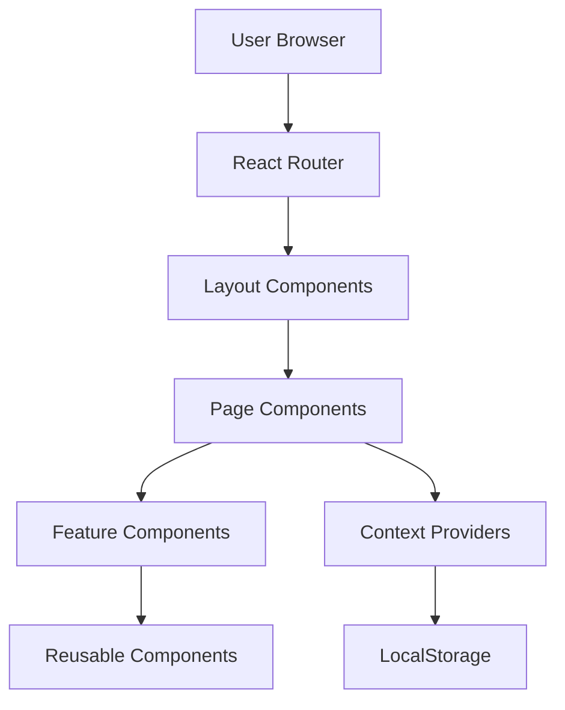
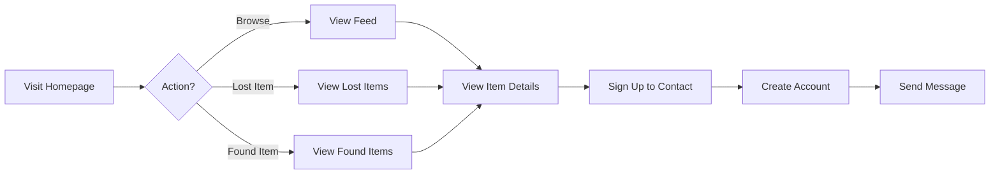
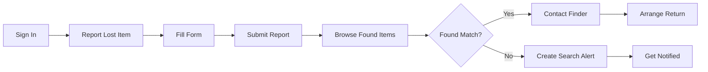
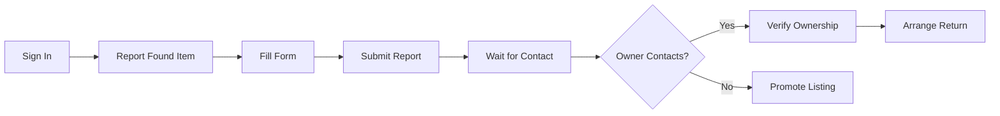
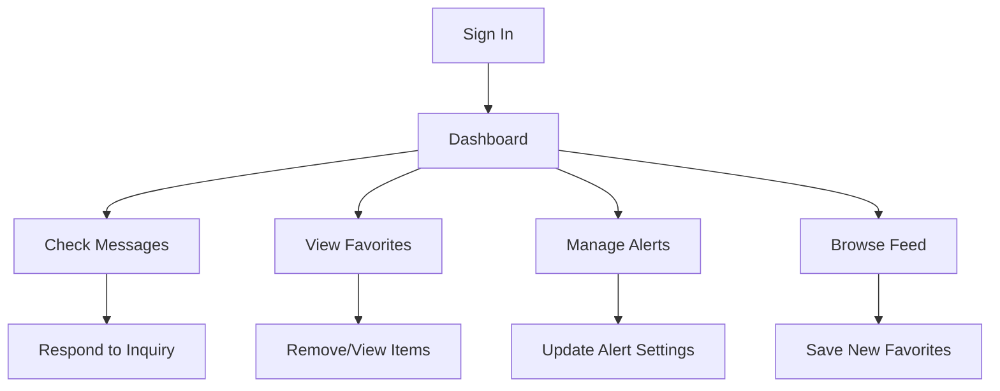
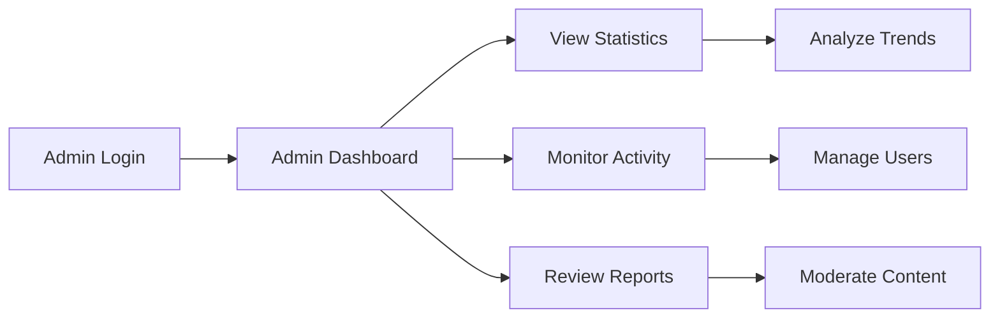

# FindIt - Lost and Found Platform
## Comprehensive Project Documentation

---

## Table of Contents
1. [Project Overview](#project-overview)
2. [Technology Stack](#technology-stack)
3. [Project Architecture](#project-architecture)
4. [Frontend Structure](#frontend-structure)
5. [Core Features](#core-features)
6. [User Flows](#user-flows)
7. [Data Models](#data-models)
8. [State Management](#state-management)
9. [Routing & Navigation](#routing--navigation)
10. [Component Library](#component-library)
11. [Styling & Design System](#styling--design-system)
12. [Setup & Installation](#setup--installation)
13. [Future Enhancement](#future-enhancements)

---

## 1. Project Overview

### 1.1 Purpose
**FindIt** is a community-driven lost and found platform designed to help people recover lost items and reunite found items with their rightful owners. The platform facilitates connections between finders and losers through a modern, user-friendly web interface.

### 1.2 Problem Statement
Lost items cause significant stress and inconvenience. Traditional lost and found systems are fragmented, making it difficult to search across multiple locations and connect with the right people. FindIt solves this by creating a centralized, searchable platform accessible to everyone.

### 1.3 Key Objectives
- **Quick Reporting**: Allow users to report lost or found items with minimal friction
- **Smart Matching**: Connect people who lost items with those who found them
- **Location-based Search**: Filter items by location for more relevant results
- **User Safety**: Protect user privacy while facilitating communication
- **Community Building**: Create a trustworthy network through user verification and ratings

---

## 2. Technology Stack

### 2.1 Frontend Technologies

| Technology | Version | Purpose |
|------------|---------|---------|
| **React** | 19.1.1 | UI library for building component-based interface |
| **React Router DOM** | 6.20.0 | Client-side routing and navigation |
| **Vite** | 7.1.7 | Build tool and dev server for fast development |
| **TailwindCSS** | 4.1.17 | Utility-first CSS framework for styling |
| **Lucide React** | 0.561.0 | Icon library for UI elements |
| **Font Awesome** | 6.5.1 | Additional icon library |

### 2.2 Development Tools

| Tool | Version | Purpose |
|------|---------|---------|
| **ESLint** | 9.36.0 | JavaScript linting |
| **Vite Plugin React** | 5.0.4 | React integration with Vite |
| **Globals** | 16.4.0 | Global variables definition |

### 2.3 Fonts & Typography
- **Primary Font**: Inter (400, 500, 600, 700, 900)
- **Secondary Font**: Poppins (500, 600, 700)
- **Icon Fonts**: Font Awesome 6.5.1, Material Symbols

---

## 3. Project Architecture

### 3.1 Directory Structure

```
d:/Lost and found/
├── frontend/
│   ├── src/
│   │   ├── components/        # Reusable UI components (40 files)
│   │   ├── pages/             # Page-level components (15 files)
│   │   ├── context/           # React Context providers (5 files)
│   │   ├── layouts/           # Layout components (2 files)
│   │   ├── hooks/             # Custom React hooks (2 files)
│   │   ├── data/              # Mock data and constants
│   │   ├── App.jsx            # Main application component
│   │   ├── main.jsx           # Application entry point
│   │   └── index.css          # Global styles
│   ├── public/                # Static assets
│   ├── index.html             # HTML template
│   ├── vite.config.js         # Vite configuration
│   └── package.json           # Dependencies
├── backend/                   # Backend directory (empty - future implementation)
├── node_modules/              # Project dependencies
└── package.json               # Root package configuration
```

### 3.2 Application Architecture Pattern

FindIt follows a **component-based architecture** with clear separation of concerns:



### 3.3 Design Patterns Used

1. **Provider Pattern**: Context API for global state management
2. **Compound Components**: Complex components built from smaller reusable pieces
3. **Custom Hooks**: Encapsulated logic for filtering, state management
4. **Container/Presentational**: Separation of data logic from UI components
5. **Higher-Order Components**: Layout wrappers for different application sections

---

## 4. Frontend Structure

### 4.1 Application Entry Point

**File**: `main.jsx`

```javascript
├── ReactDOM.createRoot()
├── BrowserRouter (React Router)
└── App Component
```

The application initializes with React 19's `createRoot` API and wraps the entire app in `BrowserRouter` for client-side routing.

### 4.2 Main Application Component

**File**: `App.jsx`

The App component orchestrates the entire application by:
- Setting up multiple context providers
- Defining route structure with two main layouts
- Protecting routes based on authentication status

**Context Provider Hierarchy**:
```
AuthProvider
└── FavoritesProvider
    └── UserProfileProvider
        └── MessagingProvider
            └── SearchAlertsProvider
                └── Routes
```

### 4.3 Two-Layout System

#### 4.3.1 MainLayout
- **Purpose**: Public-facing pages for all visitors
- **Components**: Navbar, Footer
- **Pages**:
  - Home (`/`)
  - About (`/about`)
  - Feed (`/feed`, `/lost-items`, `/found-items`)
  - Contact (`/contact`)
  - Authentication (`/auth`)
  - Report Item (`/report`)
  - Item Details (`/item/:id`)
  - User Profile (`/profile/:userId`)

#### 4.3.2 DashboardLayout
- **Purpose**: Authenticated user dashboard interface
- **Components**: Sidebar, DashboardHeader
- **Pages**:
  - User Dashboard (`/dashboard`)
  - Admin Dashboard (`/admin`)
  - My Reports (`/my-reports`)
  - Favorites (`/favorites`)
  - Messages (`/messages`)
  - Chat (`/chat/:itemId/:userId`)
  - Search Alerts (`/search-alerts`)

---

## 5. Core Features

### 5.1 Authentication System

**Context**: `AuthContext.jsx`

#### Features:
- Mock authentication system using localStorage
- Role-based access (admin/user)
- Persistent sessions across page refreshes

#### User Object Structure:
```javascript
{
  name: "John Doe",
  email: "john@example.com",
  role: "user" // or "admin"
}
```

#### Methods:
- `login(email, password)` - Authenticate user and store session
- `logout()` - Clear session and user data
- `user` - Current user object
- `loading` - Loading state for initial authentication check

#### Flow:
1. User enters credentials on `/auth` page
2. AuthContext validates and creates user object
3. User data stored in localStorage as `findit_user`
4. On app load, AuthContext checks localStorage for existing session
5. Protected routes redirect unauthenticated users

### 5.2 Item Management

#### 5.2.1 Reporting Items

**Page**: `ReportItem.jsx`

Users can report both lost and found items with the following information:

**Form Fields**:
- **Item Details**:
  - Item Name (required)
  - Category (Electronics, Accessories, Clothing, Documents, Other)
  - Color
  - Detailed Description (required)
  - Photos (upload functionality placeholder)

- **Location & Time**:
  - Location (required) - Where item was lost/found
  - Date (required) - When it was lost/found
  - Approximate Time (optional)

- **Contact Information**:
  - Name (required)
  - Email (required)
  - Phone Number (optional)

**Toggle Feature**: Users can switch between "I Lost Something" and "I Found Something" modes.

**Privacy Notice**: Contact information is marked as private and only shared upon match confirmation.

#### 5.2.2 Browsing Items

**Page**: `Feed.jsx`

Comprehensive browsing interface with:

**View Modes**:
- All Items (`/feed`)
- Lost Items Only (`/lost-items`)
- Found Items Only (`/found-items`)

**Search & Filtering**:
- Keyword Search: Search by title, description, or location
- Category Filter: Filter by item category
- Date Range: Filter by date lost/found
- Location Filter: Filter by specific locations
- Sort Options: Newest, Oldest, etc.

**User-specific Features** (Authenticated users only):
- Favorites Filter: View only favorited items
- Save Search: Create alerts for specific search criteria

**Results Display**:
- Grid layout with responsive columns (1-4 columns based on screen size)
- Post cards showing image, title, location, date, and status
- Empty state when no results found

#### 5.2.3 Item Details

**Page**: `ItemDetail.jsx`

Detailed view of individual items showing:
- Full-size image gallery
- Complete item description
- Location with map visualization
- Poster profile with rating
- Contact/Message functionality
- Related items suggestions

### 5.3 Favorites System

**Context**: `FavoritesContext.jsx`

Users can save items to their favorites for easy access later.

#### Features:
- Add/remove items from favorites
- Check if item is favorited
- Persistent storage using localStorage
- Quick access through dashboard widget

#### Methods:
- `addFavorite(itemId)` - Add item to favorites
- `removeFavorite(itemId)` - Remove item from favorites
- `isFavorite(itemId)` - Check if item is in favorites
- `favorites` - Array of favorite item IDs

### 5.4 Messaging System

**Context**: `MessagingContext.jsx`

Allows users to communicate about found/lost items.

#### Features:
- One-on-one conversations
- Conversation history
- Unread message tracking
- Real-time message updates (simulated)

**Pages**:
- `Messages.jsx` - List of all conversations
- `Chat.jsx` - Individual conversation view

### 5.5 Search Alerts

**Context**: `SearchAlertsContext.jsx`

Users can create alerts to be notified when matching items are posted.

#### Features:
- Create alerts based on search criteria
- Save complex filter combinations
- Manage active alerts
- Alert notifications (simulated)

**Alert Structure**:
```javascript
{
  id: "unique-id",
  name: "Custom Alert Name",
  filters: {
    keywords: "wallet",
    category: "Accessories",
    location: "Central Park",
    type: "lost"
  },
  createdAt: "2024-05-20"
}
```

### 5.6 User Dashboard

**Page**: `UserDashboard.jsx`

Personalized dashboard for logged-in users showing:
- **Quick Stats**: Total reports, active conversations, favorites count
- **Recent Activities**: Latest posted items
- **Recent Messages**: Quick access to conversations
- **Favorites Widget**: Saved items
- **Search Alerts**: Active alert notifications
- **Quick Actions**: Fast navigation to common tasks

### 5.7 Admin Dashboard

**Page**: `AdminDashboard.jsx`

Administrative interface for managing the platform:
- **Statistics Overview**: Platform-wide metrics
- **Activity Monitoring**: Recent user activities
- **Performance Charts**: Usage trends
- **User Management**: Activity table with filtering

---

## 6. User Flows

### 6.1 Guest User Flow



**Steps**:
1. User lands on homepage (`/`)
2. Can browse all items without authentication
3. Can search and filter items
4. Can view item details
5. Must sign in to:
   - Save favorites
   - Send messages
   - Report items
   - Create search alerts

### 6.2 Lost Item Owner Flow



**Steps**:
1. User signs in or creates account
2. Navigates to Report Item (`/report`)
3. Selects "I Lost Something"
4. Fills out detailed form with:
   - Item description and photos
   - Location and time lost
   - Contact information
5. Submits report
6. Can browse found items to find match
7. Can create search alert for automatic matching
8. When match found, contacts finder via messages
9. Arranges safe item return

### 6.3 Item Finder Flow



**Steps**:
1. User signs in or creates account
2. Navigates to Report Item (`/report`)
3. Selects "I Found Something"
4. Fills out form with item details
5. Uploads photos of found item
6. Submits report
7. Waits for rightful owner to contact them
8. Responds to messages
9. Verifies ownership before returning
10. Arranges safe return location

### 6.4 Regular User Flow



**Steps**:
1. User signs in
2. Lands on personalized dashboard
3. Can view:
   - Recent messages and respond
   - Saved favorite items
   - Active search alerts
   - Recent activity
4. Can navigate to any section through sidebar
5. Can report new items or browse feed
6. Profile displays user statistics and rating

### 6.5 Admin User Flow



**Steps**:
1. Admin signs in with admin credentials
2. Redirected to admin dashboard (`/admin`)
3. Views platform-wide statistics
4. Monitors user activity in real-time
5. Can review and moderate content
6. Analyzes performance metrics
7. Manages user accounts and permissions

---

## 7. Data Models

### 7.1 Post/Item Model

**File**: `data/posts.js`

Core data structure for lost and found items:

```javascript
{
  id: 1,                           // Unique identifier
  status: "LOST" | "FOUND",        // Item status
  title: "Brown Leather Wallet",   // Item title
  description: "Brief description",// Short description
  fullDescription: "Detailed...",  // Full detailed description
  date: "May 20, 2024",           // Date lost/found
  location: "Downtown Metro",      // Location string
  category: "Accessories",         // Category classification
  imageUrl: "https://...",        // Main image URL
  additionalImages: [],           // Array of additional image URLs
  postedBy: {                     // Poster information
    name: "Sarah Jenkins",
    username: "sarahj",
    avatar: "https://...",
    rating: 4.9,                  // User rating (0-5)
    verified: true                // Verification status
  },
  mapLocation: "New York, NY",    // Map display location
  mapImage: "https://..."         // Map image URL
}
```

**Categories Available**:
- Electronics
- Accessories
- Clothing
- Documents
- Bags
- Pets
- Keys
- Other

### 7.2 User Model

Stored in localStorage as `findit_user`:

```javascript
{
  name: "John Doe",
  email: "john@example.com",
  role: "user" | "admin"
}
```

### 7.3 Favorite Model

Stored in localStorage as `findit_favorites`:

```javascript
[1, 5, 12, 88219]  // Array of item IDs
```

### 7.4 Search Alert Model

```javascript
{
  id: "alert-1",
  name: "Lost wallet alerts",
  filters: {
    keywords: "wallet",
    category: "Accessories",
    location: "Manhattan",
    type: "found",
    dateFrom: null,
    dateTo: null
  },
  createdAt: "2024-05-20T10:30:00Z",
  active: true
}
```

### 7.5 Message/Conversation Model

```javascript
// Conversation
{
  id: "conv-1",
  itemId: 1,
  participants: ["user1", "user2"],
  lastMessage: "Is this still available?",
  lastMessageTime: "2024-05-20T15:30:00Z",
  unreadCount: 2
}

// Message
{
  id: "msg-1",
  conversationId: "conv-1",
  senderId: "user1",
  content: "Hello, I think this is my wallet",
  timestamp: "2024-05-20T15:28:00Z",
  read: false
}
```

---

## 8. State Management

### 8.1 Context API Structure

FindIt uses React Context API for global state management with 5 main contexts:

#### 8.1.1 AuthContext
**File**: `context/AuthContext.jsx`

**State**:
- `user`: Current user object or null
- `loading`: Authentication check loading state

**Methods**:
- `login(email, password)`: Authenticate user
- `logout()`: Clear authentication

**Storage**: localStorage key `findit_user`

#### 8.1.2 FavoritesContext
**File**: `context/FavoritesContext.jsx`

**State**:
- `favorites`: Array of favorite item IDs

**Methods**:
- `addFavorite(itemId)`: Add to favorites
- `removeFavorite(itemId)`: Remove from favorites
- `isFavorite(itemId)`: Check favorite status
- `toggleFavorite(itemId)`: Toggle favorite state

**Storage**: localStorage key `findit_favorites`

#### 8.1.3 UserProfileContext
**File**: `context/UserProfileContext.jsx`

**State**:
- User profile information
- User statistics
- User ratings and reviews

**Methods**: Profile management operations

#### 8.1.4 MessagingContext
**File**: `context/MessagingContext.jsx`

**State**:
- `conversations`: Array of user conversations
- `messages`: Messages grouped by conversation

**Methods**:
- `sendMessage(conversationId, content)`: Send new message
- `getConversation(id)`: Retrieve conversation
- `markAsRead(conversationId)`: Mark messages as read

#### 8.1.5 SearchAlertsContext
**File**: `context/SearchAlertsContext.jsx`

**State**:
- `alerts`: Array of active search alerts

**Methods**:
- `createAlert(alertData)`: Create new alert
- `deleteAlert(alertId)`: Remove alert
- `updateAlert(alertId, data)`: Modify alert

### 8.2 Local Component State

Components use `useState` hook for:
- Form inputs
- UI toggles (modals, dropdowns)
- Local filtering and sorting
- Temporary data before submission

### 8.3 Custom Hooks

#### 8.3.1 useAdvancedFilters
**File**: `hooks/useAdvancedFilters.js`

Implements complex filtering logic for items:
- Keyword matching across title, description, location
- Category filtering
- Date range filtering
- Location matching
- Type filtering (lost/found)
- Sorting by date, relevance

**Usage**:
```javascript
const filteredItems = useAdvancedFilters(items, {
  keywords: "wallet",
  category: "Accessories",
  dateFrom: "2024-05-01",
  dateTo: "2024-05-31",
  location: "Manhattan",
  type: "lost",
  sortBy: "newest"
});
```

---

## 9. Routing & Navigation

### 9.1 Route Structure

**File**: `App.jsx`

Routes are organized into two main groups:

#### Public Routes (MainLayout)
| Path | Component | Description |
|------|-----------|-------------|
| `/` | Home | Landing page |
| `/about` | About | About the platform |
| `/feed` | Feed | All items feed |
| `/lost-items` | Feed (type="lost") | Lost items only |
| `/found-items` | Feed (type="found") | Found items only |
| `/contact` | Contact | Contact form |
| `/auth` | Auth | Login/Signup |
| `/report` | ReportItem | Report lost/found item |
| `/item/:id` | ItemDetail | Single item view |
| `/profile/:userId` | UserProfile | User profile page |

#### Protected Routes (DashboardLayout)
| Path | Component | Description | Access |
|------|-----------|-------------|--------|
| `/dashboard` | UserDashboard | User dashboard | Authenticated |
| `/admin` | AdminDashboard | Admin panel | Admin only |
| `/my-reports` | MyReports | User's posted items | Authenticated |
| `/favorites` | Favorites | Saved items | Authenticated |
| `/messages` | Messages | All conversations | Authenticated |
| `/chat/:itemId/:userId` | Chat | Single conversation | Authenticated |
| `/search-alerts` | SearchAlerts | Manage alerts | Authenticated |

### 9.2 Navigation Components

#### 9.2.1 Navbar
**File**: `components/Navbar.jsx`

**Features**:
- Logo and brand
- Main navigation links
- User menu (when authenticated)
- Responsive mobile menu
- Search bar
- CTA buttons (Report Item, Sign In)

**States**:
- Guest state: Sign In / Sign Up buttons
- Authenticated state: User dropdown with dashboard link

#### 9.2.2 Sidebar
**File**: `components/Sidebar.jsx`

**Features**:
- Dashboard navigation menu
- User profile summary
- Quick stat cards
- Logout functionality
- Collapsible on mobile

**Menu Items**:
- Dashboard
- My Reports
- Messages (with unread count badge)
- Favorites
- Search Alerts
- Settings
- Admin Panel (admin only)

#### 9.2.3 Footer
**File**: `components/Footer.jsx`

**Sections**:
- Brand information
- Quick links
- Legal pages
- Social media links
- Newsletter signup (placeholder)
- Copyright notice

### 9.3 Navigation Patterns

**Programmatic Navigation**:
```javascript
import { useNavigate } from 'react-router-dom';

const navigate = useNavigate();
navigate('/dashboard');
navigate(-1); // Go back
```

**Link-based Navigation**:
```javascript
import { Link } from 'react-router-dom';

<Link to="/feed">Browse Items</Link>
```

**Dynamic Routes**:
```javascript
// Item detail
<Link to={`/item/${item.id}`}>View Item</Link>

// Chat
<Link to={`/chat/${itemId}/${userId}`}>Message</Link>
```

---

## 10. Component Library

### 10.1 Page Components (15)

| Component | Purpose | Key Features |
|-----------|---------|--------------|
| **Home** | Landing page | Hero section, feature showcase, CTAs |
| **About** | Platform information | Mission, team, FAQ, testimonials |
| **Auth** | Authentication | Login/signup forms, toggle mode |
| **Feed** | Item browsing | Filtering, search, grid display |
| **ReportItem** | Item submission | Multi-step form, image upload |
| **ItemDetail** | Single item view | Gallery, map, contact options |
| **UserDashboard** | User control panel | Widgets, stats, quick actions |
| **AdminDashboard** | Admin panel | Analytics, monitoring, management |
| **MyReports** | User's items | List of posted items, edit/delete |
| **Favorites** | Saved items | Grid of favorited items |
| **Messages** | Conversations list | Conversation threads, unread counts |
| **Chat** | Single conversation | Message bubbles, send interface |
| **Contact** | Contact form | Form submission, info cards |
| **UserProfile** | Public profile | User info, reviews, posted items |
| **SearchAlerts** | Alert management | Create, edit, delete alerts |

### 10.2 Layout Components (2)

#### MainLayout
**Components**: Navbar + Outlet + Footer
**Used for**: Public pages

#### DashboardLayout
**Components**: Sidebar + DashboardHeader + Outlet
**Used for**: Authenticated user pages

### 10.3 Reusable Components (40)

#### Display Components
| Component | Purpose |
|-----------|---------|
| **FeedPostCard** | Item card in feed grid |
| **ItemImageGallery** | Image viewer with thumbnails |
| **ItemDetailsCard** | Item information display |
| **ItemHeader** | Item title and status badge |
| **ItemDescription** | Formatted item description |
| **PosterProfile** | User info with avatar and rating |
| **RatingDisplay** | Star rating visualization |
| **ReviewCard** | User review display |
| **AlertCard** | Search alert card |
| **StatCard** | Dashboard statistic card |
| **ActivityTimeline** | Activity feed component |
| **PerformanceChart** | Chart visualization (placeholder) |
| **ItemMap** | Location map display |

#### Form Components
| Component | Purpose |
|-----------|---------|
| **ContactForm** | Contact page form |
| **ReviewForm** | Submit review form |
| **CreateAlertModal** | Alert creation modal |
| **FilterPanel** | Advanced filtering sidebar |
| **FilterChip** | Active filter tag |

#### Navigation Components
| Component | Purpose |
|-----------|---------|
| **Navbar** | Main site navigation |
| **Sidebar** | Dashboard sidebar menu |
| **Footer** | Site footer |
| **DashboardHeader** | Dashboard page header |
| **QuickActions** | Quick action buttons |

#### Widget Components
| Component | Purpose |
|-----------|---------|
| **FavoritesWidget** | Dashboard favorites preview |
| **RecentItemsWidget** | Recently posted items |
| **RecentMessagesWidget** | Recent conversations |
| **SearchAlertsWidget** | Active alerts widget |
| **NotificationsSummary** | Notification center |
| **StatsOverview** | Statistics summary |
| **UserStats** | User-specific statistics |

#### Messaging Components
| Component | Purpose |
|-----------|---------|
| **ConversationList** | List of conversations |
| **ChatWindow** | Chat interface |
| **MessageBubble** | Individual message |

#### Utility Components
| Component | Purpose |
|-----------|---------|
| **FavoriteButton** | Add/remove favorite button |
| **ItemActions** | Item action buttons |
| **SocialButtons** | Social sharing buttons |
| **SafetyNotice** | Safety information banner |
| **FAQItem** | Collapsible FAQ item |
| **ContactInfoCard** | Contact information card |
| **ActivityTable** | Admin activity table |

---

## 11. Styling & Design System

### 11.1 Design Philosophy

FindIt follows a **minimalistic, professional design** with emphasis on:
- **Clarity**: Clean layouts with ample whitespace
- **Accessibility**: High contrast, readable fonts
- **Consistency**: Reusable design tokens
- **Responsiveness**: Mobile-first approach
- **Modern**: Contemporary UI patterns and micro-interactions

### 11.2 Color Palette

**File**: `index.css`

**Primary Colors**:
```css
--navy: #1e293b;         /* Dark blue for headings */
--teal: #14b8a6;         /* Primary brand color */
--teal-dark: #0d9488;    /* Hover states */
--slate: #64748b;        /* Body text */
```

**Semantic Colors**:
```css
--red-500: #ef4444;      /* Errors, destructive actions */
--emerald-400: #34d399;  /* Success states */
--purple-500: #a855f7;   /* Accent color */
--blue-500: #3b82f6;     /* Information */
```

**Neutral Colors**:
```css
--gray-50: #f9fafb;      /* Backgrounds */
--gray-100: #f3f4f6;     /* Subtle backgrounds */
--gray-200: #e5e7eb;     /* Borders */
--white: #ffffff;        /* Cards, surfaces */
```

### 11.3 Typography

**Font Families**:
```css
font-family: 'Inter', sans-serif;      /* Body text */
font-family: 'Poppins', sans-serif;    /* Headings */
```

**Font Scales**:
- **Headings**: 4xl (36px), 3xl (30px), 2xl (24px), xl (20px), lg (18px)
- **Body**: base (16px), sm (14px), xs (12px)
- **Weights**: 400 (regular), 500 (medium), 600 (semibold), 700 (bold), 900 (black)

### 11.4 Spacing System

TailwindCSS default spacing scale:
- Base unit: 0.25rem (4px)
- Common values: 1 (4px), 2 (8px), 3 (12px), 4 (16px), 6 (24px), 8 (32px), 12 (48px), 20 (80px)

### 11.5 Component Styles

#### Card Styles
```css
.card-minimal {
  background: white;
  border-radius: 16px;
  border: 1px solid #e5e7eb;
  box-shadow: 0 1px 2px rgba(0,0,0,0.05);
}
```

#### Button Styles
```css
.btn-primary {
  background: #14b8a6;
  color: white;
  padding: 12px 24px;
  border-radius: 12px;
  font-weight: 600;
  transition: all 0.2s;
}

.btn-primary:hover {
  background: #0d9488;
  transform: translateY(-1px);
  box-shadow: 0 4px 12px rgba(20, 184, 166, 0.3);
}

.btn-secondary {
  background: white;
  color: #1e293b;
  border: 1px solid #e5e7eb;
  padding: 12px 24px;
  border-radius: 12px;
  font-weight: 600;
}
```

#### Input Styles
```css
.input-minimal {
  padding: 12px 16px;
  border: 1px solid #e5e7eb;
  border-radius: 12px;
  transition: all 0.2s;
}

.input-minimal:focus {
  outline: none;
  border-color: #14b8a6;
  box-shadow: 0 0 0 3px rgba(20, 184, 166, 0.1);
}
```

### 11.6 Responsive Breakpoints

TailwindCSS default breakpoints:
- **sm**: 640px (Mobile landscape)
- **md**: 768px (Tablet)
- **lg**: 1024px (Desktop)
- **xl**: 1280px (Large desktop)
- **2xl**: 1536px (Extra large)

### 11.7 Design Patterns

#### Status Badges
```javascript
// Lost item: Red badge
<span className="bg-red-500/10 text-red-700 px-3 py-1 rounded-full">
  LOST
</span>

// Found item: Green badge
<span className="bg-emerald-400/10 text-emerald-700 px-3 py-1 rounded-full">
  FOUND
</span>
```

#### Hover Effects
- Subtle uplift: `transform: translateY(-2px)`
- Shadow enhancement: Increase shadow on hover
- Color shift: Darken on hover
- Scale: `transform: scale(1.02)` for images

#### Loading States
- Skeleton screens for content
- Spinner for actions
- Pulse animation for emphasis

---

## 12. Setup & Installation

### 12.1 Prerequisites

- **Node.js**: Version 16.x or higher
- **npm**: Version 8.x or higher (comes with Node.js)
- **Git**: For version control
- **Modern Browser**: Chrome, Firefox, Safari, or Edge

### 12.2 Installation Steps

#### Step 1: Clone Repository
```bash
git clone <repository-url>
cd lost-and-found
```

#### Step 2: Install Dependencies
```bash
# Install root dependencies
npm install

# Install frontend dependencies
cd frontend
npm install
cd ..
```

#### Step 3: Environment Setup
No environment variables required for current version (mock data).

#### Step 4: Run Development Server
```bash
# From root directory
npm run dev

# Or directly in frontend
cd frontend
npm run dev
```

The application will start at `http://localhost:5173` (Vite default port).

### 12.3 Build for Production

```bash
cd frontend
npm run build
```

This creates an optimized production build in `frontend/dist/`.

### 12.4 Preview Production Build

```bash
cd frontend
npm run preview
```

### 12.5 Linting

```bash
cd frontend
npm run lint
```

### 12.6 Project Scripts

**Root `package.json`**:
```json
{
  "scripts": {
    "dev": "cd frontend && vite",
    "test": "echo \"Error: no test specified\" && exit 1"
  }
}
```

**Frontend `package.json`**:
```json
{
  "scripts": {
    "dev": "vite",
    "build": "vite build",
    "lint": "eslint .",
    "preview": "vite preview"
  }
}
```

---

## 13. Future Enhancements

### 13.1 Backend Implementation

**Planned Technologies**:
- **Node.js** with Express.js or NestJS
- **Database**: PostgreSQL or MongoDB
- **Authentication**: JWT or OAuth 2.0
- **File Storage**: AWS S3 or Cloudinary for images
- **Real-time**: Socket.io for live messaging

**Backend Features**:
- RESTful API endpoints
- Database schema implementation
- File upload handling
- User authentication & authorization
- Real-time messaging
- Email notifications
- Search indexing

### 13.2 Advanced Features

#### Real-time Notifications
- WebSocket integration
- Push notifications
- Email alerts for matches
- SMS notifications (optional)

#### AI-Powered Matching
- Image recognition for item matching
- Natural language processing for descriptions
- Smart recommendations
- Duplicate detection

#### Enhanced Security
- Two-factor authentication
- Verified user badges
- Report suspicious activity
- Content moderation
- Privacy controls

#### Geolocation
- Interactive maps
- Proximity-based search
- Location-based alerts
- Geofencing for matches

#### Mobile Application
- React Native mobile app
- Offline capabilities
- Camera integration
- Push notifications

### 13.3 Platform Improvements

#### Analytics
- User behavior tracking
- Success rate metrics
- Popular categories
- Geographic insights
- Performance monitoring

#### Social Features
- User ratings and reviews
- Reputation system
- Community guidelines
- Success stories section
- Leaderboards

#### Payment Integration
- Optional reward system
- Subscription plans
- Premium features
- Donation options

#### API & Integrations
- Public API for third parties
- Integration with lost and found services
- Social media sharing
- Police department integration

### 13.4 Technical Debt

- Implement actual backend API
- Replace mock data with database
- Add comprehensive test coverage (unit, integration, E2E)
- Implement proper error handling and logging
- Add accessibility improvements (ARIA labels, keyboard navigation)
- Optimize images and assets
- Implement caching strategies
- Add internationalization (i18n)
- Create comprehensive API documentation

---

## Conclusion

FindIt is a modern, comprehensive lost and found platform built with React and designed to facilitate community-driven item recovery. The current frontend implementation provides a solid foundation with a complete user interface, intuitive user flows, and scalable architecture.

The platform is ready for backend integration and offers numerous opportunities for enhancement through AI, real-time features, and mobile applications. With its clean design, thoughtful user experience, and robust component library, FindIt is positioned to become a valuable community resource for reuniting lost items with their owners.

---

**Document Version**: 1.0  
**Last Updated**: December 25, 2024  
**Project Status**: Frontend Complete, Backend Pending  
**Total Pages**: 15 page components, 40 reusable components  
**Lines of Code**: ~15,000+ (estimated)
